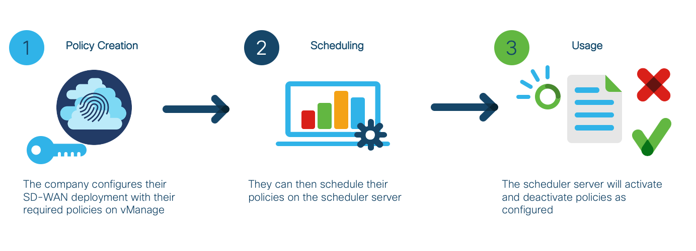
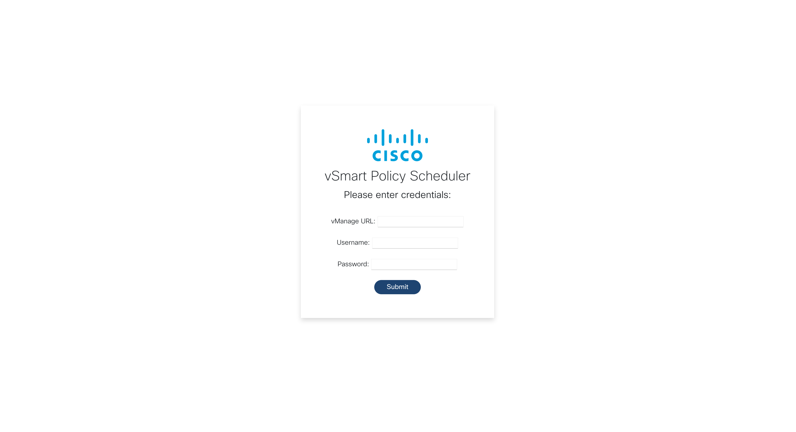
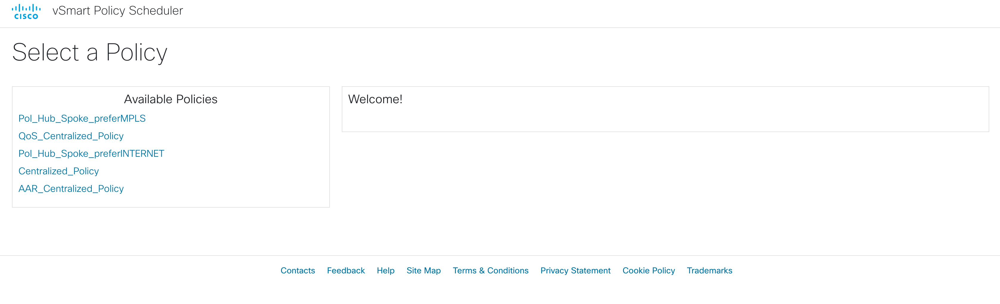
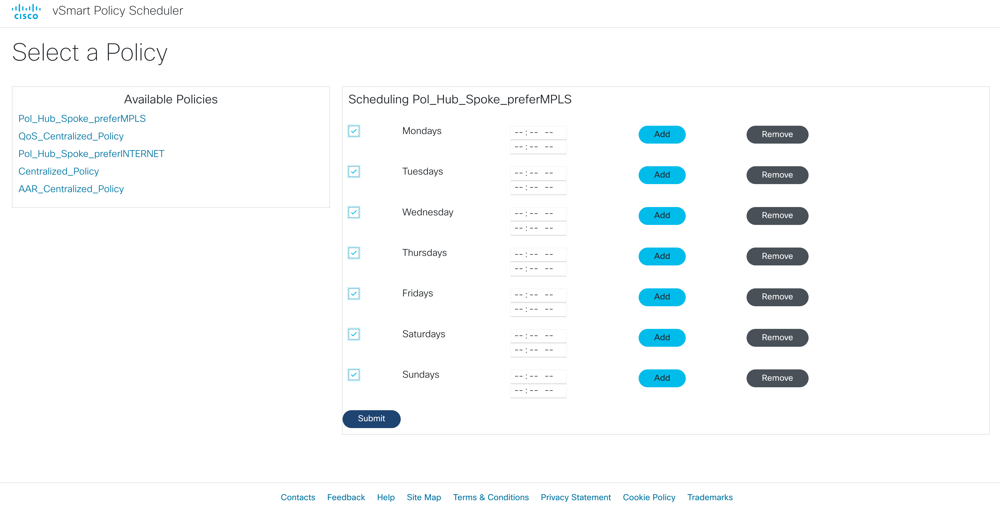

# vSmart Policy Scheduler
This is the Cisco SD-WAN vSmart Policy Scheduler source code. Using vManage API's, we can configure a schedule for vSmart policies
and when they should be active or not. Time ranges can be configured to set the active times for the policies.

The schedulers are stored in a database which is queried regularly by the server to determine which policies should be activated
or deactivated.

### High Level Design


## Contacts

* Josh Ingeniero (jingenie@cisco.com)
* Monica Acosta (moacosta@cisco.com)
* Robert Landires (rlandire@cisco.com)

## Solution Components
* Flask
* Docker
* Python
* JavaScript
* Cisco vManage API’s

## Installation:

#### Clone the repo
```console
$ git clone https://github.com/gve-sw/vsmart-policy-scheduler
```

### Python

#### Install dependencies
```zsh
$ pip3 install -r requirements.txt
```

### Docker
You may build the docker image from this repo. You may edit [docker-compose.yml](docker-compose.yml) to change the desired timezone:
```yaml
environment:
      TZ: "Asia/Singapore"
```
A list of valid timezones is available at https://en.wikipedia.org/wiki/List_of_tz_database_time_zones under _TZ Database Name_

#### 

## Setup:
You can deploy this prototype in a lab environment, dCloud instance, or on your own deployment.
You would then need to either input your details through the web GUI or edit a config file below.

#### vManage details :
You need to have your _VMANAGE IP Address, USERNAME, and PASSWORD_. 
Fill in the details of your vManage deployment in the [DETAILS.py](DETAILS.py) file
```python
VMANAGE = 'VMANAGE IP:PORT'
J_USERNAME = 'USERNAME'
J_PASSWORD = 'PASSWORD'
```

## Usage:

### Python
Launch the Scheduler Server. Make sure that you have your venv activated.
```commandline
$ flask run --host=0.0.0.0 --port=5000
```

### Docker
Launch the Scheduler Server through the docker-compose file.
```commandline
$ docker-compose up
```

### Login Screen


### Policy Selection


### Policy Scheduling



## License
Provided under Cisco Sample Code License, for details see [LICENSE](./LICENSE.txt)

## Code of Conduct
Our code of conduct is available [here](./CODE_OF_CONDUCT.md)

## Contributing
See our contributing guidelines [here](./CONTRIBUTING.md)